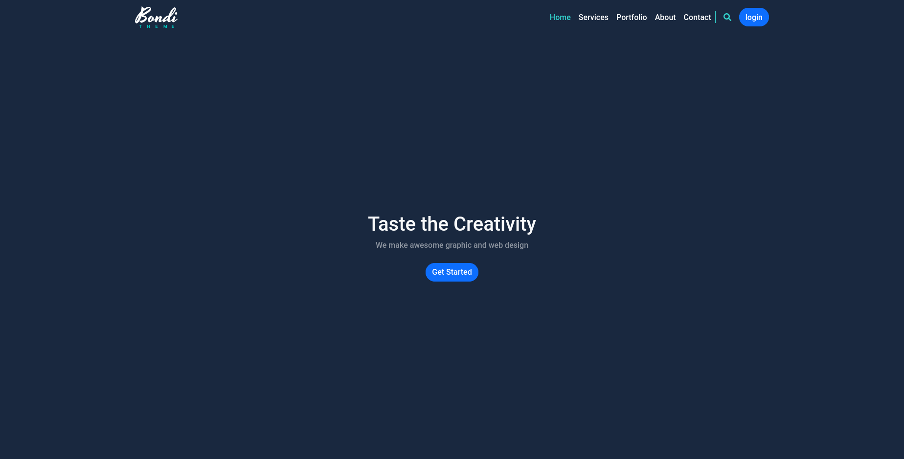
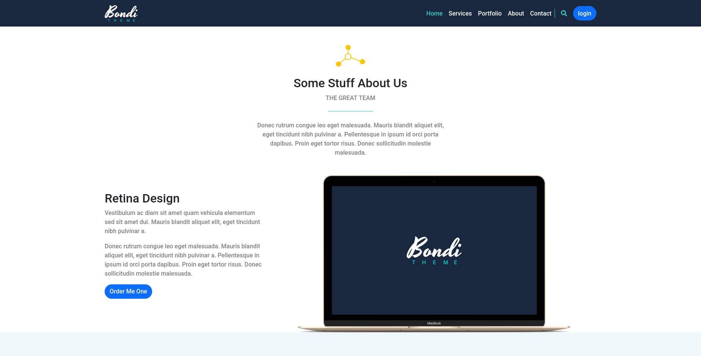

# Bondi-bootstrap-project

## Table of contents

- [Overview](#overview)
  - [The challenge](#the-challenge)
  - [Screenshot](#screenshot)
  - [Links](#links)
- [My process](#my-process)
  - [Built with](#built-with)

## Overview

### The challenge

Users should be able to:

- View the optimal layout depending on their device's screen size
- See hover and focus states for interactive elements

### Screenshot

.
.
### Links

- Solution URL: [Solution URL](https://github.com/Mohammed-Abol-Fotouh/Bondi-bootstrap-project)
- Live Site URL: [Live Site URL](https://mohammed-abol-fotouh.github.io/Bondi-bootstrap-project/)

## My process

### Built with

- Semantic HTML5 markup
- CSS custom properties
- Flexbox
- Mobile-first workflow
- Bootstrap

